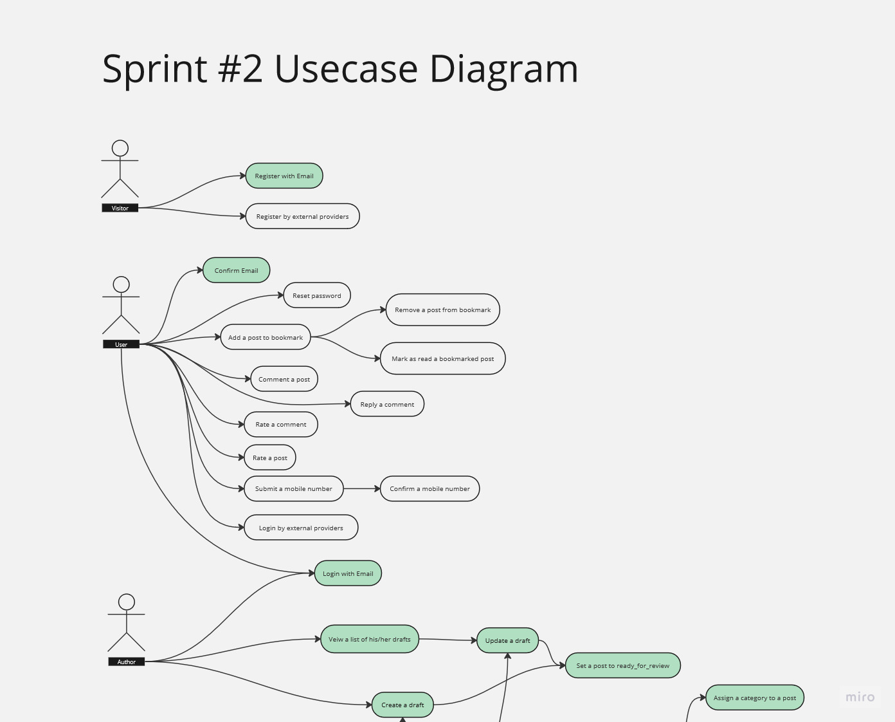

# Quick C#,.NET Tutorial
see the vieos here :https://drive.google.com/file/d/1EV0O2enyFRQ8MhJF7ZWD0_bI1S5iytNh/view?usp=sharing
## Getting Started
### C# vs .NET ??
NET is a software development framework that
provides tools and libraries for building various
types of applications, while C# is a programming
language designed for creating those applications within
the .NET ecosystem. Essentially, .NET is the platform,
and C# is the language used to write code for that
platform.
### Things to install
- You need to download and install .NET SDK on your system
- You need to pick a  IDE of your choice .Want my suggestion?
  go with JetBrains Rider; it is lightweight and free

### Check your installation
open a terminal and write the following command
```shell
dotnet version
```
and you should something like this :
```
8.0.200
```
everything is alright? Let's go
## Let's create a Console Application
open your terminal and write the following:
```shell
dotnet new console -o MyTestProject
```
Above command will create a new folder in your current
working directory with this name : `MyTestProject`.
Let's see what is inside this folder by `cd MyTestProject`:run `ls` command
if you are in linux or macOS . run `dir` if you are in windows

```shell
11/03/2024  11:53 PM    <DIR>          .
11/03/2024  11:53 PM    <DIR>          ..
11/03/2024  11:53 PM    <DIR>          bin
11/03/2024  11:53 PM    <DIR>          obj
11/03/2024  11:53 PM               105 Program.cs
11/03/2024  11:53 PM               252 TestConsoleApplication.csproj
               2 File(s)            357 bytes
               4 Dir(s)  293,422,592,000 bytes free
```
I will explain you every file or folder you see here.
but for now let's run the application . How ?

```shell
dotnet run 
```
your will something like this text:
```shell
Hello, World!
```
Congragulations! ; your first C# Hello world


## Program.cs
This is a very special file in C# . every c# project must has a program.cs file in its root.
you will see this is how actually program.cs is :
```csharp
Console.WriteLine("Hello World !");
```
in old c# versions . it was like this :
```csharp
class Program
{
    static void Main(string[] args)
    {
        Console.WriteLine("Hello World !");
    }
}
```
C# is c-family language . so this code should be very familiar to you if you have tried C or C++
When you say : `dotnet run`, C# compiler will generate the executable binary file from `Main` function of `Program` class

We will talk about functions , methods , classes later . do not worry

## Variables in C#
```csharp
static void Main(string[] args){
        //this line is a comment
        //variable declaration
        int x = 10;
        x++;
        x--;
        x += 2;
        x -= 10;
        x *= -1;
        x = -50;
        x = Math.Abs(x);
        uint y = -10; //compile time error
        long z = -10;
        ulong = -10 //compile time error
        short t = 100000000; //compile time error

        float f = 1.2f;
        double d = 9.002;


        string name = "albert";
        string name2=2;//compile time error
        bool flag = true;
        char letterA = 'A';
        int LetterB = 'B';
        
        DateTime registerDate = DateTime.Now;
        DateTime registerDateTimeInUtc = DateTime.UtcNow;

        DateTime startDate = new DateTime(2024, 2, 2, 19, 30, 0);


}
```

## Interaction with console
```csharp
static void Main(string[] args){
        string name="Karim";   
        string userInput = Console.ReadLine(); //getting input from console        
        Console.Write(name);
        Console.Write(12);
        Console.WriteLine("Hi");
        Console.WriteLine(userInput);
        
        //the out put will be like this : 
        /*
        Karim12
        Hi
        [WhatEver user inputs in the console is displayed here]
        */
}
```

## Type Conversion
```csharp
static void Main(string[] args){
         //type conversion:
        string averageInString = "19";
        int average = int.Parse(averageInString);

        string averageInBadString = "avg is 19";
        int avgerage2 = int.Parse(averageInBadString); //runtime error

        int score = 13;
        string scoreInString = score.ToString();
}
```
## String Concatenation
```csharp
static void Main(string[] args){
           //string concatenation
        string firstName = "Mohammad";
        string lastName = "Yousefiyan";
        string fullName = firstName + " " + lastName;
        string alsoFullName = string.Format("{0} {1}", firstName, lastName);

}
```
## Easier way to declare variables
```csharp
static void Main(string[] args){
       //using var when declaring variable
        int someVariable = 10;
        var alsoSomeVariable =10; //C# is intelligent enough to know that 10 is 10 . so you do not have to tell him explicitly

}
```
## Flow Control
```csharp
static void Main(string[] args){
        string name="some_name";
        //conditions
        if (true)
        {
            //do something
        }
        else
        {
            //do something else
        }

        if (name == "sevda" && x<0)
        {
            //some code
        }
        else if (name == "karim" || name == "goli")
        {
            //some code
        }
        else if (name== "hakan")
        {
            //some code
        }
        else
        {
            //some code
        }
        
}
```
## Array

```csharp
static void Main(string[] args){
        var numbers = new int[10]; // an array of fixed size 10;
        int[] numbers2 = []; //an empty array of dynamic size
        string[] names = ["goli", "hasan"];
        //adding an element to the end of the array
        names = names.Append("karim").ToArray(); //Append Function is defined on  the array object and returns  IEnumberable
        //so , in order to get  the array back , we should use .ToArray() method  
        
}
```
`IEnumerable`,`List` have a lot of details which you do not need to know them right now . we will use them alot in the project . do not worry

## Loop
```csharp
static void Main(string[] args){
         string[] names = ["goli", "hasan","sahar","mari"];
        //loops:
        for (int i = 0; i < 10; i++)
        {
            Console.WriteLine("i is : {0}",i);
        }
        //printing even numbers from 1 to 100 on the console:
        for (int i = 2; i <= 100; i += 2)
        {
            Console.WriteLine(i);
        }
        //priting 3 digit numbers like x where x power 2 is a devisible to 4
        for (int i = 100; i < 1000 && i % 4 == 0; i++)
        {
            Console.WriteLine(i);
        }

        foreach (var n in names)
        {
            Console.WriteLine(n);
        }

        bool stopWhile = false;
        
        while (!stopWhile)
        {
            x *= 2;
            if (x < Math.Pow(2, 10))
            {
                stopWhile = true;
            }
            Console.WriteLine(x);
        }
        //another example
        List<int> grades = [];
        while (true)
        {
            string inp = Console.ReadLine();
            foreach (var item in inp.Split(' '))
            {
                grades.Add(int.Parse(item));
            }
        }
}

```

Congragulations ! Now, you know the basics.
Let's continue our journey by building a exciting Blogging System !

Take a look at the below use case digram for our system



